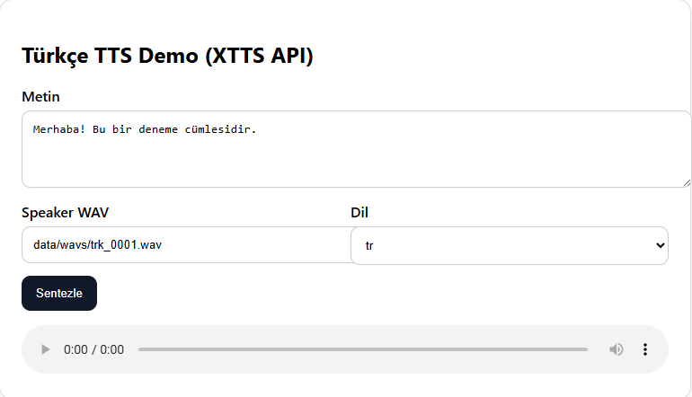

# TTS Voice Cloning Demo (TR/EN) — XTTS API

Türkçe ve İngilizce için **ses klonlama (speaker conditioning) + TTS** demo uygulaması. Proje tamamen açık kaynak olacak şekilde tasarlanmıştır ve kolay geliştirilebilir bir örnek sunar.

An English version is included below.

---

## 🇹🇷 Türkçe

### Özellikler
- **TR/EN TTS**: Metinden konuşma üretimi
- **Ses klonlama (speaker WAV ile)**: Kısa bir referans ses ile konuşmacı karakteristiğini taklit eder
- **FastAPI servis**: Basit bir API ve web demo arayüzü
- **Web Demo**: `web_demo.html` üzerinden tek sayfalık arayüz
- **Basit cache**: Aynı istekleri hızlandırmak için LRU cache



### Proje Yapısı
`data/`
  `wavs/`             WAV dosyaları (mono, 24 kHz, 16-bit, `trk_0001.wav` ...)
  `metadata.csv`      `filename|transcript` formatında örnek metadata
  `mapping_original_to_new.csv`  kaynak dosya -> yeni wav eşlemesi
`server.py`           FastAPI uygulama giriş noktası
`src/tts_demo/`       Uygulama kodu (API, XTTS yükleyici, WAV yardımcıları, CLI)
`web_demo.html`       Basit web arayüzü
`requirements.txt`    Python bağımlılıkları

### Sistem Gereksinimleri
- **Python**: 3.10+ (önerilir)
- **İşletim Sistemi**: Windows / Linux / macOS
- **Donanım**
  - **CPU**: Çalışır (daha yavaş)
  - **GPU (CUDA)**: Önerilir (daha hızlı)
- **Disk / RAM**: Model indirmeleri ve çalışma için yeterli alan/RAM gerekir

Not: `TTS` paketi ilk çalıştırmada modeli indirebilir.

### Kurulum
```bash
pip install -r requirements.txt
```

### Çalıştırma (API + Web Demo)
```bash
uvicorn server:app --host 0.0.0.0 --port 8000
```

Tarayıcı:
- `http://localhost:8000/`

### API Kullanımı

#### Sağlık kontrolü
`GET /health`

#### Konuşmacı listesi (WAV tarar)
`GET /speakers?dir=data/wavs`

#### Sentez (WAV döner)
`POST /synthesize`

Örnek istek:
```json
{
  "text": "Merhaba! Bu bir deneme cümlesidir.",
  "speaker": "data/wavs/trk_0001.wav",
  "language": "tr"
}
```

#### Stream
`GET /stream?q=...&speaker=...&language=tr`

### Geliştirme Notları
- Model ve varsayılanlar `src/tts_demo/xtts.py` içinde yönetilir.
- Cache boyutu ortam değişkeniyle ayarlanabilir:
  - `TTS_CACHE_SIZE=0` cache kapalı
  - `TTS_CACHE_SIZE=32` (varsayılan)

### Nasıl Geliştirilebilir?
- **UI geliştirme**: `web_demo.html` üzerinde arayüzü zenginleştirebilirsin (dosya seçici, speaker listesi dropdown, hata mesajları vb.)
- **Yeni endpoint**: Örn. `POST /synthesize_mp3` veya `POST /synthesize_json` (base64) eklenebilir
- **Model seçenekleri**: Model adı, dil, sampling parametreleri env/config ile yönetilebilir
- **Docker**: Servisi container’a alıp tek komutla çalıştırma sağlanabilir
- **Test**: Basit entegrasyon testleri (FastAPI TestClient) eklenebilir

### Sorun Giderme
- **`ModuleNotFoundError`**: `pip install -r requirements.txt` çalıştırdığından emin ol.
- **Model indirme/ilk açılış uzun sürüyor**: İlk çalıştırmada model indirme normaldir.
- **Windows path sorunları**: `speaker` alanına verdiğin wav yolunun mevcut olduğundan emin ol.

### Lisans
Bu proje **MIT License** ile lisanslanacaktır. Detaylar için `LICENSE` dosyasına bak.

---

## 🇬🇧 English

### Overview
An open-source **TR/EN voice cloning (speaker conditioning) + TTS** demo built with **FastAPI** and an XTTS-based backend. It is designed to be easy to understand, run, and extend.


### Features
- **TR/EN TTS** text-to-speech generation
- **Voice cloning via speaker WAV** reference audio
- **FastAPI API** with a minimal web UI
- **Web demo page** served from `web_demo.html`
- **LRU cache** for repeated requests

### Project Structure
`data/` contains sample WAVs and metadata.
`server.py` is the FastAPI entrypoint.
`src/tts_demo/` contains API + model loading + audio utilities.

### Requirements
- Python 3.10+
- CPU works (slower); CUDA GPU recommended (faster)

### Install
```bash
pip install -r requirements.txt
```

### Run (API + Web UI)
```bash
uvicorn server:app --host 0.0.0.0 --port 8000
```

Open:
- http://localhost:8000/

### API
- `GET /health`
- `GET /speakers?dir=data/wavs`
- `POST /synthesize` (returns `audio/wav`)
- `GET /stream?q=...&speaker=...&language=en`

### License
MIT License. See `LICENSE`.
